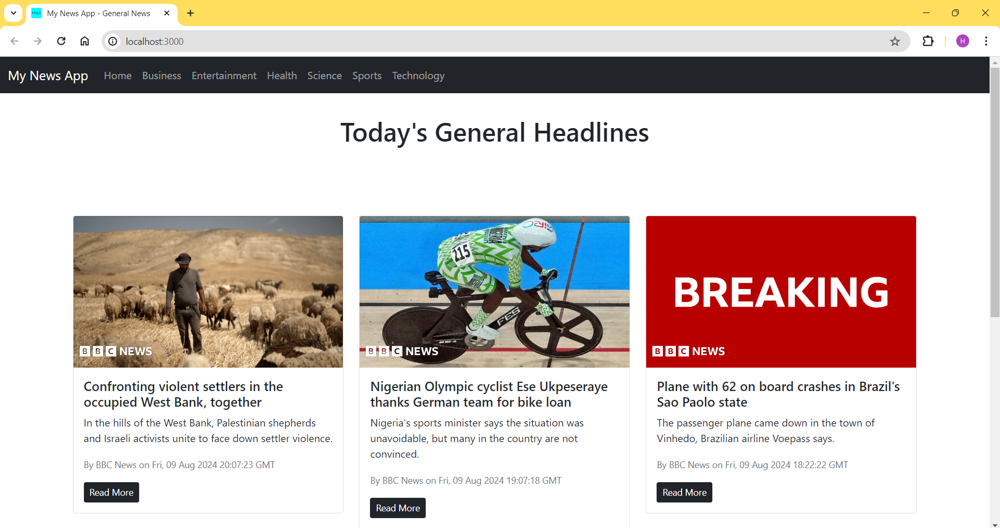

# NewsApp-React

A React-based news application that provides users with the latest headlines from various categories. This project demonstrates React fundamentals, including API integration, infinite scrolling, and responsive design.



## Features

- **Infinite Scrolling**: Automatically load more news articles as the user scrolls down.
- **Category Navigation**: View news in different categories such as Business, Entertainment, Health, Science, Sports, and Technology.
- **Responsive Design**: Adapted for both mobile and desktop views.
- **Loading Spinner**: Displays a spinner while fetching news articles.

## Installation

1. **Clone the repository**:
   ```bash
   git clone https://github.com/hiteshchinu/NewsApp-React.git
   ```

2. **Navigate into the project directory**:
   ```bash
   cd NewsApp-React
   ```

3. **Install dependencies**:
   ```bash
   npm install
   ```

4. **Create a `.env.local` file** in the root directory of the project and add your API key:
   ```env
   REACT_APP_NEWS_API_KEY=your_api_key_here
   ```

5. **Start the development server**:
   ```bash
   npm start
   ```

   Open your browser and go to `http://localhost:3000` to view the application.


## Components

- **`App`**: The main component that sets up routing and page structure, handling navigation between different news categories.
- **`NavBar`**: Provides a responsive navigation bar with links to various news categories.
- **`News`**: Fetches and displays news articles for the selected category with infinite scrolling and a loading spinner.
- **`NewsItem`**: Represents an individual news article, displaying the title, description, image, and a link to the full article.
- **`Spinner`**: Shows a loading spinner while news data is being fetched.

## Tech Stack

- **React**: JavaScript library for building user interfaces.
- **Bootstrap**: CSS framework for responsive design.
- **React Router**: For navigation between different routes.
- **NewsAPI**: Provides the news data.

## API Key

To use the NewsAPI, you need an API key. Sign up on [NewsAPI](https://newsapi.org/) to get your API key and add it to the `.env.local` file as described in the installation instructions.

## Contributing

Feel free to fork the repository and submit pull requests. Any contributions are welcome!
